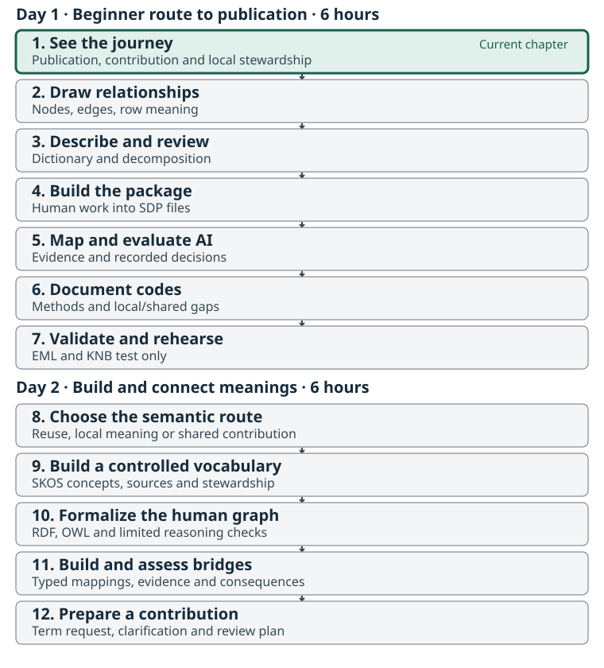

:::::::::::::::::::::::::::::::::::::: questions

- What changes between a source spreadsheet and a reusable published dataset?
- What will we make at each stage of the workshop?
- Why do we describe the data ourselves before using packaging software or AI?

::::::::::::::::::::::::::::::::::::::::::::::::

::::::::::::::::::::::::::::::::::::: objectives

- Recognize the source table and the intended catalog destination for the same Fraser Coho example.
- Name each stage's problem and output without needing to run the software.
- Distinguish data values, descriptions of those values, and links to shared definitions.
- Explain why the first working diagram and dictionary must precede metasalmon and AI.

::::::::::::::::::::::::::::::::::::::::::::::::

## Start with the destination

Imagine finding a salmon [dataset](glossary.html#dataset) produced by another team. Can you tell what was estimated, which population and place it concerns, how the estimate was made, and whether it is suitable for your question? A download button alone cannot answer those questions.

The facilitator begins with the [Fraser Coho teaching record](reference.html#teaching-record), then opens the source CSV beside it. The reference page records the endpoint's actual status and evidence. A draft or test record is a demonstration; it is not evidence that this workshop has a verified public deposit. If a verified endpoint is still pending, use the supplied local publication preview and say so explicitly.

This is a **tour of the result**, not a software exercise. Participants do not send data to metasalmon or AI in this chapter. We will first create our own diagram and dictionary, then review them with another person in Chapters 2–3.

### What to look for in the record

Follow four questions rather than every catalog field:

1. **What is this?** Find the title, scope, source and contact information.
2. **Can I use it?** Find the access conditions, licence and important caveats.
3. **Can I understand it?** Locate the table description, column definitions and method information.
4. **Can I trace it?** Follow the source and version information back to the packaged table.

These are practical aims of [FAIR](glossary.html#fair): findable, accessible, interoperable and reusable data. Accessibility may involve stated conditions; FAIR does not mean that every dataset must be openly downloadable.

## Meet our one shared example

Download and extract the [Fraser Coho workshop kit](files/fraser-coho-workshop.zip). Everyone follows the **173-row, 14-column NuSEDS Fraser Coho 2023–2024 slice** in `raw_data/nuseds-fraser-coho-2023-2024.csv`. Open a copy for viewing in a spreadsheet, or follow the projected table. Keep the source file unchanged.

The slice comes from Fisheries and Oceans Canada's Fraser and BC Interior NuSEDS workbook. The kit preserves its source information, derivation and the current [official DFO dictionary](files/fraser-coho-workshop/raw_data/official-nuseds-dictionary.csv). That dictionary was retrieved on 8 September 2026 and may postdate the workbook used for this slice. It is a selected two-year teaching dataset, not the full NuSEDS database or a complete history of Fraser Coho.

The table contains 87 distinct `POP_ID` values and **164 distinct population–analysis-year pairs across 173 rows**. Some pairs occur more than once. A row is therefore a source record associated with a population, waterbody and analysis year; **population plus year is not a verified unique key**. Later we will examine what additional context distinguishes the records. Do not delete repeated pairs or sum their estimates during the workshop.

Six columns let us practice the main kinds of description:

| Source column | What we can see | Question that still needs evidence |
| --- | --- | --- |
| `POP_ID` | A population identifier, such as `46200` | What source unit does the identifier denote? |
| `WATERBODY` | A named waterbody, such as `BONAPARTE RIVER` | How does this named place relate to the population record? |
| `ANALYSIS_YR` | `2023` or `2024`: the year the estimate is for | Why can contributing surveys extend into the next calendar year? |
| `SPECIES` | `Coho` throughout this slice | How is the source species label defined? |
| `NATURAL_ADULT_SPAWNERS` | Numerical estimates and 13 blanks | What does “natural” qualify, and what does a blank mean? |
| `ESTIMATE_METHOD` | Labels such as `Area Under the Curve` | How does the stated procedure affect interpretation? |

We will write descriptions for these six fields ourselves. The other eight fields remain in the table and must also be read and reviewed. A focused exercise is not permission to discard context.

## Values and descriptions do different jobs

The first record associates population ID `46200`, `BONAPARTE RIVER`, analysis year `2023`, `Coho`, estimate `758` and method `Resistivity Counter`. Those are **data values**. Explaining what the identifier, estimate and method mean is [metadata](glossary.html#metadata): information that helps someone interpret and reuse those values.

An identifier is a label used to refer to something. It is not the thing itself. Likewise, a waterbody, a biological population, a species category and a Conservation Unit describe different things. The table has no Conservation Unit field. We can discuss that wider context, but we cannot invent a CU assignment from these rows.

One compound name is enough to motivate the next chapters: `NATURAL_ADULT_SPAWNERS`. A [variable](glossary.html#variable) describes the question being represented, while its [property](glossary.html#property) is the characteristic of interest, such as abundance, and its [entity](glossary.html#entity) is the thing the data concerns. “Adult”, “natural”, the place, the year basis, the unit and the method may add different kinds of meaning. We will separate them and record uncertainty instead of treating the column name as a complete definition.

## The journey we will follow

| Chapter | Problem it addresses | What you leave with |
| --- | --- | --- |
| 1. See the whole journey | A useful final result is hard to picture | A shared purpose and one reuse question |
| 2. Draw the dataset | Relationships and row meaning are implicit | A human-created node-and-edge diagram with evidence and questions |
| 3. Describe and decompose | Short column names hide assumptions | A dictionary, variable decomposition and peer-review record |
| 4. Build the package | Meaning and data can become separated | An SDP built from the same table and reviewed human descriptions |
| 5. Compare AI-assisted interpretation | Automated suggestions can seem more certain than their evidence | A comparison with the human baseline and documented decisions |
| 6. Review shared meanings | Similar labels may represent different concepts | Reviewed mappings, code meanings and unresolved term questions |
| 7. Validate and share | A valid file alone is not a reusable publication | A checked package and an honest publication handoff |

**Diagram → dictionary and decomposition → human peer review → metasalmon → AI-assisted comparison.** This order is part of the method. Your first explanation of the dataset must exist before tools propose one for you.

### A few names you will hear later

A **Salmon Data Package (SDP)** keeps the table, [data dictionary](glossary.html#data-dictionary), code definitions, dataset description and other context together. `metasalmon` in R and `metasalmonpy` in Python help create and inspect that package. We introduce their names here; detailed commands belong in Chapter 4.

The workshop [Glossary](glossary.html) is a reading aid: it explains words used in these lessons. A [controlled vocabulary](glossary.html#controlled-vocabulary) is a maintained set of terms and definitions used to describe data consistently. Reading a glossary entry helps you understand the discussion; choosing a vocabulary term requires checking its maintained definition against your data.

An [ontology](glossary.html#ontology) also states relationships between concepts. An [IRI](glossary.html#iri) is a stable identifier used to refer to a term. Later, we compare the meaning we have documented with candidate definitions in the Salmon Domain Ontology and other resources. Similar wording does not establish an exact match.

[EML](glossary.html#eml) is a structured format for ecological metadata. Catalogs such as [KNB](glossary.html#knb), part of the DataONE network, use metadata to help people discover and assess data. We will return to the opening record in Chapter 7 and explain how the workshop's artifacts support it.

::::::::::::::::::::::::::::::::::::: challenge

## Activity: Read the example as a future user

In pairs, inspect the source table and teaching record or local preview. Spend 10 minutes identifying one question you could answer from the table and one you could not answer safely.

Then write three short notes:

- The field or value that raises your question.
- The description, relationship or source evidence that would help.
- The workshop stage where you expect to resolve it.

Share one example. Keep unanswered questions for the diagram and dictionary exercises. An unresolved question is a useful result; an invented answer is not.

::::::::::::::::::::::::::::::::::::::::::::::::

::::::::::::::::::::::::::::::::::::: keypoints

- The same 173-row, 14-column Fraser Coho slice carries every chapter.
- A reusable dataset needs understandable values, context, relationships, sources and access conditions.
- The dataset has 164 distinct population–year pairs; that pair does not uniquely identify every row.
- We draw and describe the dataset, then peer review our account, before using metasalmon or AI.
- A catalog preview, a draft record and a verified public deposit have different statuses.

::::::::::::::::::::::::::::::::::::::::::::::::
