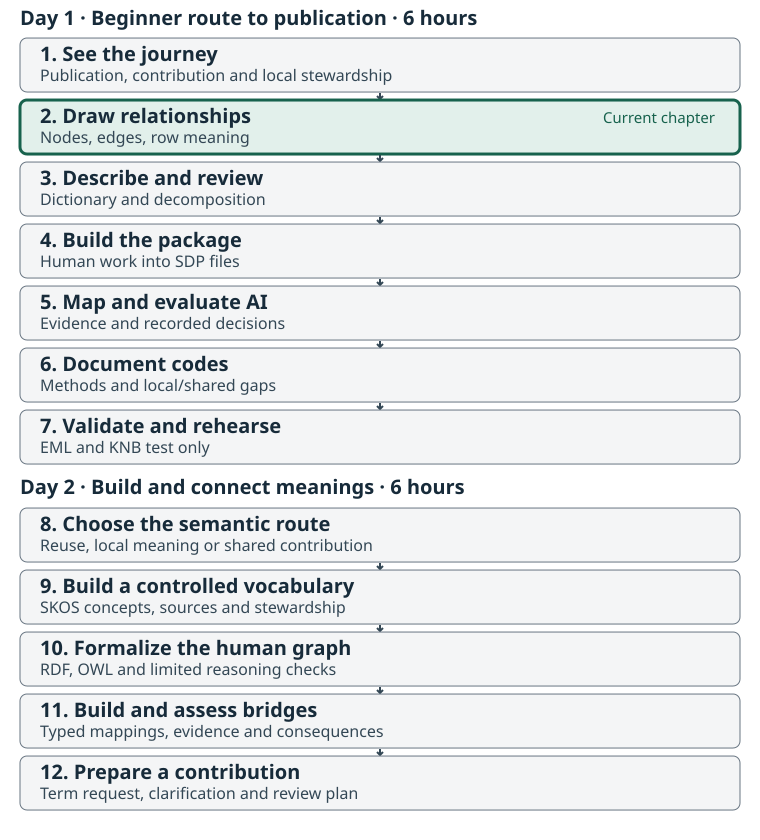

:::::::::::::::::::::::::::::::::::::: questions

- What is a row about, and which things must remain distinct?
- How can a simple diagram make hidden relationships and assumptions visible?
- What should we record now so the diagram could support formal ontology work later?

::::::::::::::::::::::::::::::::::::::::::::::::

::::::::::::::::::::::::::::::::::::: objectives

- Draw a node-and-edge model of the Fraser Coho table using plain-language relationships.
- Distinguish source records, population identifiers, waterbodies, species, years and estimates.
- Link diagram statements to source fields and mark unsupported relationships as questions.
- Save an editable diagram and text-based node/edge tables before using packaging or AI tools.

::::::::::::::::::::::::::::::::::::::::::::::::



## Start with people and the source table

Use the same `raw_data/nuseds-fraser-coho-2023-2024.csv` from Chapter 1. This chapter uses paper, a whiteboard or an ordinary drawing application, plus a spreadsheet or text editor. **Do not load the dataset into metasalmon or an AI service.** First make your own account of what the data is about.

Work inside the extracted kit:

```text
fraser-coho-workshop/
  raw_data/       source CSV and supplied source information
  worksheets/     your diagram tables, dictionary and review record
  reference/      draft worked examples and scientific-review questions
  scripts/        used after the human review in Chapter 3
  output/         used for later generated packages
```

The worksheets are editable. Preserve the source files. If working on paper, photograph or scan the finished diagram and keep it in `worksheets/`; also complete the node/edge tables so the relationships can be read without an image.

## What a simple graph adds

A **node** names something relevant to the dataset. An **edge** states how one node relates to another. Write a short verb phrase on each arrow, such as “identifies”, “is reported for” or “has result”. An unlabelled line leaves its meaning to the next reader.

Give each node a local ID such as `N1`. These IDs connect the diagram to the worksheet. They are not official NuSEDS identifiers or newly minted ontology terms.

| Record | What to write |
| --- | --- |
| Node | Local ID, plain label, kind of thing, related source fields, evidence, status and any question |
| Edge | Start-node ID, relationship phrase, end-node ID, related source fields, evidence, status and any question |

The supplied [node worksheet](files/fraser-coho-workshop/worksheets/dataset-nodes.csv) and [edge worksheet](files/fraser-coho-workshop/worksheets/dataset-edges.csv) provide these columns. Use “observed in file”, “working interpretation” or “question” to show the kind of support behind a statement.

## Begin with row meaning

[Row grain](glossary.html#row-grain) describes what one record represents and the context needed to distinguish it from others. Start your drawing with **a source record**, then add the things that the record identifies or describes.

The source has 173 rows but only 164 distinct `POP_ID`–`ANALYSIS_YR` pairs. For example, `POP_ID` `46170` has two records for `2023`: `NICOLA RIVER (DAM)` and `NICOLA RIVER (DOT)`. Both have a blank adult-spawner estimate and `NO SURVEY THIS YEAR` classification. Their shared population/year values are not evidence that one row should be removed.

Draw the distinction between:

- the **identifier value** in `POP_ID` and the source population it identifies;
- the **waterbody name** and the place it refers to;
- the **species label** and the population/organisms being described;
- the **analysis-year value** and the biological or reporting basis that gives that year meaning;
- an **estimate result** and the observation or estimation activity that produced it.

Do not assume every row represents exactly one field visit. The source's method and survey-window fields may summarize work; the exact observation/estimation structure remains a question for source review.

### Where does a Conservation Unit fit?

A Conservation Unit, a biological population, a species and a stream are not interchangeable levels of one simple hierarchy. The current [NuSEDS catalog description](https://open.canada.ca/data/en/dataset/c48669a3-045b-400d-b730-48aafe8c5ee6) describes populations by freshwater location and run timing, referenced to stream mouths; those populations can be grouped by CU. This table has no CU column or population-to-CU membership table. You may add a dashed **“CU relationship to investigate”** node beside your graph, but do not assign a CU, draw an asserted membership edge, or label the relationship “is a” without supporting evidence.

Use the same discipline for stream relationships. “This source record names this waterbody” is supported directly by the table. The current official dictionary describes the waterbody or portion that bounds the population on its source estimate document (SEN). “This population occurs only in this waterbody” is a stronger biological claim that the table alone does not establish.

## Expand one estimate into meaningful parts

The Salmon Domain Ontology's [metamodel view](https://github.com/salmon-data-mobilization/salmon-domain-ontology/blob/main/ontology/views/README.md) provides a plain-language guide. It is an **optional, non-normative orientation model**; the shared ontology's core modules hold its reusable definitions.

For `NATURAL_ADULT_SPAWNERS`, add nodes that help distinguish:

| Part | Plain-language question |
| --- | --- |
| [Entity](glossary.html#entity) | What population or group does the estimate concern? |
| [Property](glossary.html#property) | What characteristic is represented, such as abundance? |
| [Variable](glossary.html#variable) | What complete data question is the column answering? |
| [Observation or estimation activity](glossary.html#observation) | What work produced the result? |
| [Result](glossary.html#result) and [unit](glossary.html#unit) | What value was reported, and in what units? |
| [Method](glossary.html#method) | How was the result determined? |
| [Constraint](glossary.html#constraint) and other context | Which qualifiers change the meaning or scope? |

Use `758` from the first source record as a labelled **example value**, not as the definition of the variable. Relate `ESTIMATE_METHOD` to the estimation activity. The current official dictionary defines adults as mature fish excluding jacks and the year as the year the estimate is for; surveys may extend into the next calendar year. It does not establish a natural-origin restriction. Keep that qualifier, applicability of current definitions to the source workbook, and any additional biological year-basis claim as review questions. The next chapter makes these distinctions explicit in the dictionary.

## Keep a route to later formalization

We are making a conceptual model, not writing OWL. Clear labels, typed nodes, directed relationships, evidence and uncertainty will help an ontology specialist formalize the model later. A local diagram does not approve new terms or prove equivalence with an existing term.

Keep broad kinds of things separate from examples. A box labelled “waterbody” and an example `BONAPARTE RIVER` should not silently become the same object. Record whether a node is a concept, source record, identifier, example value or unresolved placeholder. The typed distinction is more useful now than formal syntax.

::::::::::::::::::::::::::::::::::::: challenge

## Activity: Draw, explain and revise

1. **Draw for 15 minutes.** Include the six focus fields, one source record, one example value and the entity/property/variable/activity/result distinction. Label every relationship.
2. **Explain for 10 minutes.** Your partner traces one row through the drawing. Ask which arrows come directly from the file and which need a definition or other source.
3. **Revise for 10 minutes.** Correct ambiguous arrows, mark questions, and enter the nodes and edges in `worksheets/dataset-nodes.csv` and `worksheets/dataset-edges.csv`. Save the editable drawing or paper capture with them.

Use the [draft working diagram](files/fraser-coho-workshop/reference/dataset-graph-working.svg) only after making your first drawing. It is a comparison aid, not a scientifically approved answer key. Its [node](files/fraser-coho-workshop/reference/dataset-nodes-working.csv) and [edge](files/fraser-coho-workshop/reference/dataset-edges-working.csv) tables expose the underlying statements; `reference/dataset-graph-working.md` in the kit explains its limits.

**Checkpoint:** every arrow has a label; its endpoints exist in the node table; the source-record grain is stated; population, waterbody, species and CU are not collapsed; questions remain visible. Keep the diagram for the formal peer review in Chapter 3.

::::::::::::::::::::::::::::::::::::::::::::::::

::::::::::::::::::::::::::::::::::::: keypoints

- Draw the dataset before packaging it or asking AI to interpret it.
- A useful graph makes relationships, row meaning, evidence and uncertainty explicit.
- Population, waterbody, species and Conservation Unit are distinct; this table does not supply a CU mapping.
- The observation activity, variable and result value need different nodes.
- An editable diagram plus text-based node/edge tables supports later reuse and formalization.

::::::::::::::::::::::::::::::::::::::::::::::::
