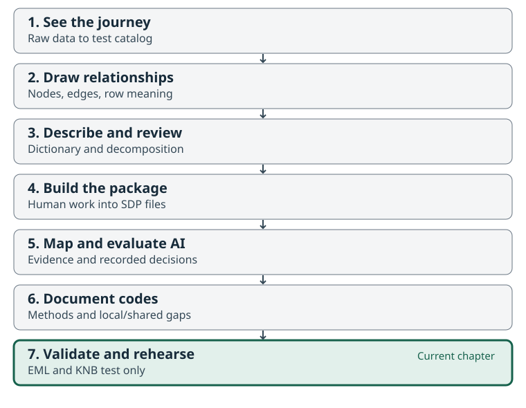

:::::::::::::::::::::::::::::::::::::: questions

- What distinguishes a good finished package from a structurally valid draft?
- How does an SDP become EML and a catalog record?
- What can a test deposit demonstrate, and what would production publication add?

::::::::::::::::::::::::::::::::::::::::::::::::

::::::::::::::::::::::::::::::::::::: objectives

- Trace source data, human interpretation, reviewed metadata, EML, and catalog objects.
- Interpret strict validation without confusing it with scientific approval.
- Inspect the clearly labelled KNB test teaching record or its supplied local artifacts.
- Explain production publication steps without executing a production deposit.

::::::::::::::::::::::::::::::::::::::::::::::::



## The problem: a reusable package needs both meaning and a reliable access path

At the start of the workshop you saw the destination. Now follow the evidence that connects it to the source: unchanged rows, a human diagram, definitions and decomposition, recorded mapping decisions, code meanings, and a package another person can interpret.

A good finished product is more than a set of non-empty cells. Its context supports its claims, unresolved questions are visible, files agree, and the intended reader can find and use it. The [reference page](reference.html#teaching-record) identifies the current teaching record and its verification status.

Our catalog exercise uses the **KNB Test Node**, with the same 173-row, 14-column Fraser Coho source. The official source remains on Open Canada. We do not create another production publication of it in this workshop.

## Check what is ready and what still needs work

The classroom draft is `output/fraser-coho-workshop-sdp`. Preserve it, its worksheets, and the actual review decisions. The kit's `checkpoints/reference-sdp/` is a facilitator comparison artifact; read its stage and review notes before describing it as reviewed. A technical validation result does not substitute for a named human scientific review.

Use these questions to assess the package:

| Check | Evidence to inspect |
| --- | --- |
| Is this still the same source? | All 173 rows, 14 columns, and values; source checksum and derivation record. |
| Can another person explain the rows and columns? | Human graph, dictionary, decomposition, and recorded peer review. |
| Are measurement mappings supported? | Source definitions, chosen terms, rejected suggestions, and remaining questions. |
| Are code values described? | Code coverage plus source-based definitions and method context. |
| Are descriptive and publication facts defensible? | Attribution, contacts, source licence, temporal coverage, provenance, and intended access. |
| Do files agree technically? | Validation results, descriptor consistency, checksums, and the EML schema result. |

The source has **13 blank spawner estimates and 14 recorded zeroes**. These are different observations about the file. Do not convert blanks to zero or infer that `Not Applicable` has one universal relationship to a missing estimate.

## Run the strict package check

::::::::::::::::::::::::::::::::::::: group-tab

### R


``` r
pkg_path <- file.path("output", "fraser-coho-workshop-sdp")
metasalmon::validate_salmon_datapackage(pkg_path, require_iris = TRUE)
```

Read the first failing requirement and connect it to your review notes. Unresolved `REVIEW:` markers or missing required semantic fields must be addressed through review, not removed just to pass.

### Python

```python
from pathlib import Path
from metasalmonpy import validate_salmon_datapackage

pkg_path = Path("output") / "fraser-coho-workshop-sdp"
validate_salmon_datapackage(str(pkg_path), require_iris=True)
```

Use the pinned package environment from Setup. Passing this check does not close Python's separate native-review capability gap or confirm the scientific interpretation.

### Spreadsheet

Inspect the validator report produced by your R or Python collaborator against your edited metadata. Locate a reported field in the CSV and explain the decision needed to resolve it. Spreadsheet inspection by itself does not run the strict validator.

::::::::::::::::::::::::::::::::::::::::::::::::

If your draft cannot pass, retain the report and its unresolved questions. You can still trace the rest of the process using the supplied same-source reference artifacts. Clearly distinguish a step you executed from a result you inspected.

The reference passes the pinned MetaSalmon strict package check and EML validation, but the separate `smn-data-pkg` validator rejects the semantic keys projected into its descriptor. This is known item #90 in the MetaSalmon backlog; it is not a reported pass of every validator. The kit contains an <a href="files/fraser-coho-workshop/validation/upstream-validator-issue.md" download>unposted issue draft and exact reproducer</a>. Keep that result separate from scientific review and the [teaching-record status](reference.html#teaching-record).

## Follow the package into EML

[EML](glossary.html#eml), Ecological Metadata Language, expresses discovery and data-description metadata in a standard XML structure. It is a downstream representation of the package, not a replacement for the human preparation or canonical SDP metadata.

The exporter needs facts that cannot be recovered from column names alone: structured parties, rights, methods, measurement scales, missing-value meanings, and source context. The reviewed `metadata/eml-mapping.yml` sidecar supplies such facts. This is where details deferred from Chapter 1—numeric versus nominal domains, date domains, and EML field requirements—become useful.

Inspect `metadata/eml-mapping.yml` and any supplied `publication/test/eml.xml` in the reference checkpoint. Trace one source-column definition into the EML attribute description. Then find the source citation, teaching-record label, and test-environment URLs. Use the canonical [SDP-to-EML workflow][metasalmon-eml-workflow] and [mapping template][metasalmon-eml-mapping] for the full requirements.

The pinned R and Python exporters also require checksum-bound semantic evidence and accepted-selection files. The R package validates this closure but does not provide a general public function that produces every required file. The supplied reference build must document how those artifacts were made and what was actually reviewed. Do not fabricate a reviewer, licence, checksum, missing-value explanation, or accepted decision to satisfy the exporter. This limitation can be retired when the pinned release supplies and verifies the complete producer workflow.

## Preview a test deposit

A dry run plans the identifiers, files, checksums, access policy, and relationships without credentials or network calls. The workshop scripts explicitly target `knb_environment = "test"` and use the expanded representation so the metadata files remain individually inspectable.

Run this only when the package has the required export facts, or inspect the supplied reference plan. The script requires an explicit package copy beneath `output/` and refuses checkpoint paths. For practice, copy the reference checkpoint to a new destination; preserve the supplied checkpoint and its stage notes. This copy does not make its scientific review complete.

::::::::::::::::::::::::::::::::::::: group-tab

### R


``` r
# Make a separate local practice copy once; never overwrite an existing copy.
reference_path <- file.path("output", "reference-practice-sdp")
stopifnot(!dir.exists(reference_path))
dir.create(reference_path, recursive = TRUE)
source_files <- list.files(
  file.path("checkpoints", "reference-sdp"),
  full.names = TRUE, all.files = TRUE, no.. = TRUE
)
stopifnot(all(file.copy(source_files, reference_path, recursive = TRUE)))
```

From the project's terminal, run the test-only planner against that copy:

```bash
Rscript scripts/plan_test_deposit.R output/reference-practice-sdp
```

The key call is `publish_sdp_to_knb(..., public = TRUE, dry_run = TRUE, representation = "expanded", knb_environment = "test")`. Read the exact planned object list and intended public access before any separately authorized deposit.

### Python

```python
from pathlib import Path
import shutil

# copytree refuses an existing destination, protecting earlier practice work.
reference_path = Path("output") / "reference-practice-sdp"
shutil.copytree(Path("checkpoints") / "reference-sdp", reference_path)
```

From the project's terminal, run the test-only planner against that copy:

```bash
python scripts/plan_test_deposit.py output/reference-practice-sdp
```

The key call uses `public=True`, `dry_run=True`, `representation="expanded"`, and `knb_environment="test"`. EML and KNB extras must be installed as directed in Setup. If dependencies or required facts are unavailable, inspect the supplied same-source plan and record that limitation.

### Spreadsheet

Open the supplied `publication/test/knb-manifest.json` with the facilitator. Identify the metadata object, data table, named SDP metadata files, and resource map. Match one object to its local file and checksum. The plan is a description of a proposed test deposit, not proof that the catalog contains it.

::::::::::::::::::::::::::::::::::::::::::::::::

Test output belongs under `publication/test/`. A test deposit uses `urn:node:mnTestKNB` at `https://dev.nceas.ucsb.edu/`, with DataONE staging services. The test route requests no preservation replicas, cannot receive a DOI through this workflow, and is not a durable production record. Test objects are not promoted to production.

## Inspect the teaching record

Open the [teaching-record link and status](reference.html#teaching-record). It is explicitly labelled **“Workshop demonstration — KNB Test Node”** and links to the official source. Check the current access and verification note before the activity.

For a verified public test record, each learner should be able to open it without signing in, read the metadata, and download the intended example files. Follow a description from the source and human dictionary into the displayed catalog metadata. Inspect the separate package components and their relationships.

If the reference page says the deposit is pending, private, unavailable, or not yet verified, use the supplied local artifacts and screenshots and report exactly that status. `published_pending_catalog` means object storage has progressed but the required catalog evidence is incomplete. It is not a completed catalog demonstration, and recreating identifiers does not fix the indexing question.

Test services can change or remove records. The downloadable kit remains the common classroom reference and makes the example inspectable when the test service is unavailable.

## Explain the production steps without executing them

A production publication needs its own source-rights decision, final metadata review, repository choice, intended access, and responsible depositor. It also needs a fresh production plan and production identifiers. A test record is never a shortcut around these decisions.

For an appropriate future dataset, the sequence is:

1. Confirm source rights, attribution, intended reuse, and whether another production deposit is warranted.
2. Complete human scientific review, package validation, and EML validation.
3. Review a fresh plan for the named production repository and intended access.
4. Have the authorized depositor make the production deposit with the correct authenticated identity.
5. Verify object integrity, access, catalog indexing, and the user-facing record.
6. Follow the repository's public-release and DOI process when applicable, and preserve the record for later versioning.

These are explanatory steps in this workshop. The learner scripts contain no live upload or production-deposit action. The source's existing Open Canada record remains the authoritative source publication.

For a later metadata revision, preserve the previous package and manifest, build a new version in a separate directory, document the change, and review its new plan. Published object bytes and identities are not edited in place.

::::::::::::::::::::::::::::::::::::: challenge

## Activity: tell the full story of one estimate

In 20 minutes, trace one `NATURAL_ADULT_SPAWNERS` record through the source, human dictionary, diagram, mapping decision, EML, and catalog or supplied local representation. Explain its population/year context and method, preserving any source uncertainty.

Finish by identifying one requirement that a production publication would add and one claim that technical validation alone cannot justify. Mark each step as **executed**, **inspected**, or **not yet available** in your notes.

::::::::::::::::::::::::::::::::::::::::::::::::

::::::::::::::::::::::::::::::::::::: keypoints

- A good finished package combines supported meaning, traceable evidence, and usable access.
- Strict validation and schema-valid EML do not establish human scientific approval.
- The classroom destination is a clearly labelled test demonstration of the same NuSEDS source.
- Production publication is explained, separately authorized, and not executed here.

::::::::::::::::::::::::::::::::::::::::::::::::
